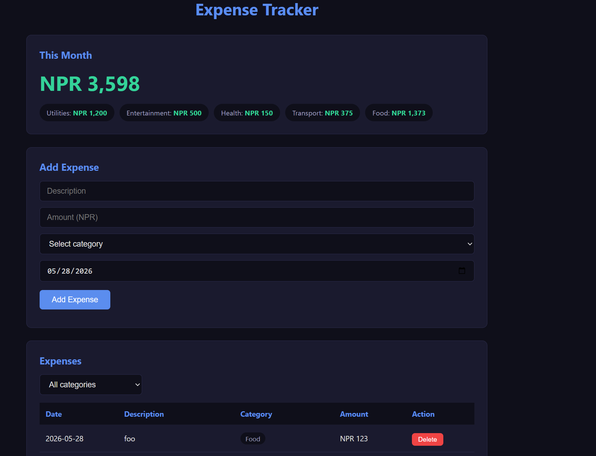

# ExpenseTracker

A Jakarta EE REST API for tracking personal expenses, with a vanilla JS frontend.

Built with plain servlets and JDBC — no Spring, no Hibernate — to deeply understand how REST APIs work at the HTTP level.



## What it does

- Add, view, and delete expenses by category
- Filter expenses by category (Food, Transport, Utilities, etc.)
- Monthly summary showing total spent and breakdown by category
- REST API consumed by a vanilla JS frontend using fetch()

## Tech stack

| Layer | Tech |
|-------|------|
| Language | Java 21 |
| Web | Jakarta EE, Servlets |
| Data access | Plain JDBC |
| Database | MySQL 8 |
| Build | Maven |
| Server | Tomcat 10.1 |
| Frontend | HTML, CSS, Vanilla JS |

## API endpoints

| Method | Endpoint | Description |
|--------|----------|-------------|
| GET | `/api/expenses` | Get all expenses |
| GET | `/api/expenses?category=Food` | Filter by category |
| GET | `/api/expenses/{id}` | Get one expense |
| POST | `/api/expenses` | Create new expense |
| DELETE | `/api/expenses/{id}` | Delete expense |
| GET | `/api/summary` | Monthly total + breakdown |

## Why I built it this way

I deliberately avoided Spring and Hibernate to understand how REST APIs actually work — how HTTP verbs map to operations, how JSON is read from request bodies and written to responses, and how the DAO pattern keeps database logic separate from request handling.

## Project structure

    src/main/
    ├── java/
    │   ├── servlets/     # ExpenseServlet, SummaryServlet
    │   ├── models/       # Expense entity
    │   ├── dao/          # ExpenseDAO (JDBC)
    │   └── utils/        # DBConnection
    └── webapp/
        ├── index.html    # Single page frontend
        ├── css/          # Dark theme styles
        ├── js/           # fetch() API calls
        └── WEB-INF/

## Running locally

**Prerequisites:** Java 21, Maven, MySQL 8, Tomcat 10.1

1. Clone the repo
   ```bash
   git clone https://github.com/PralonBasnet/ExpenseTracker.git
   ```
2. Create the database
   ```bash
   mysql -u root -p < expense_tracker.sql
   ```
3. Update DB credentials in `src/main/java/com/expensetracker/utils/DBConnection.java`
4. Build and deploy
   ```bash
   mvn clean package
   ```
5. Deploy `target/ExpenseTracker.war` to Tomcat 10.1
6. Open `http://localhost:8080/ExpenseTracker`

## What I'd do differently next time

- Add authentication so expenses are per-user
- Use connection pooling (HikariCP) instead of opening a new connection per request
- Add input validation on the server side
- Write unit tests for the DAO layer

---

